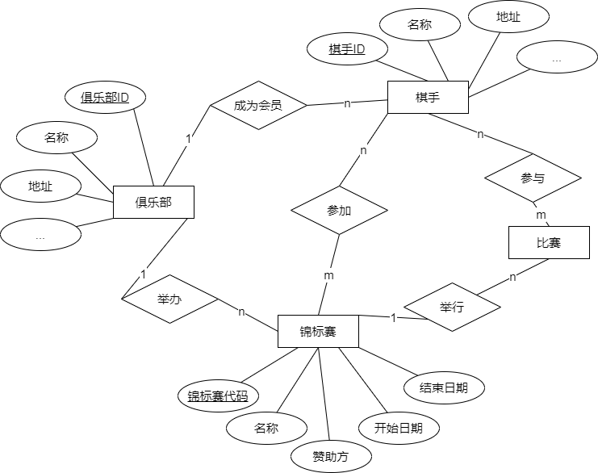
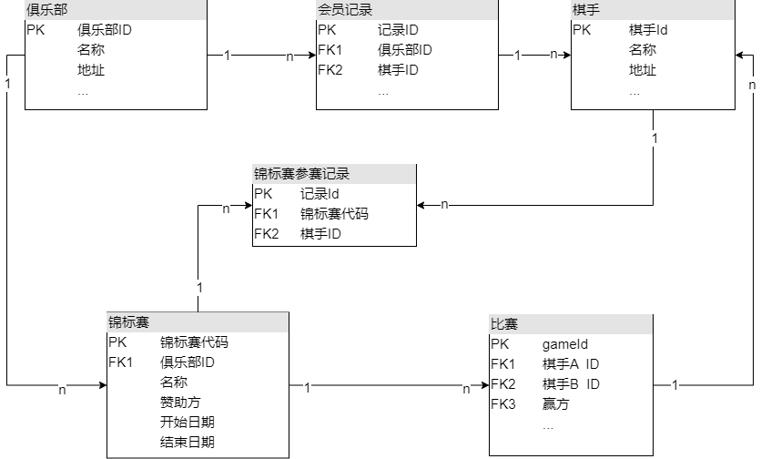

## 第一题、Nginx日志文件统计分析

- **1_nginx_log_analyze.ipynb**：主要代码文件，使用 PySpark 对存放在 HDFS 上的 Nginx日志文件进行分析
- **RowData.py**：Nginx行数据类
- **nginx_log**：文件夹，存放了测试 Nginx 日志文件数据


### 第二题、通关记录统计

- **2_event_log_analyze.sql**：主要 SQL 代码文件，内容如下：

  ```mysql
  -- event_log 建表语句
  
  CREATE TABLE `event_log` (
    `user_id` int DEFAULT NULL,
    `event_timestamp` varchar(50) DEFAULT NULL
  ) COMMENT='事件记录表';
  
  -- event_log 示例数据
  
  INSERT INTO event_log (user_id,event_timestamp) VALUES
  	 (8373613,'1603189321'),
  	 (3232343,'1603189452'),
  	 (1343299,'1603189498'),
  	 (8372761,'1603189611'),
  	 (7689821,'1603189734'),
  	 (8373613,'1599062400'),
  	 (8372761,'1600099200'),
  	 (8373613,'1601395200');
  
  -- 查询语句
  -- 查询有多少用户在2020年9月开启关卡数大于等于1000小于2000
  
  select count(*) as `count`
  from (
  	select user_id
  	from event_log
  	where from_unixtime(event_timestamp, '%Y-%m') = '2020-09'
  	group by user_id
  	having count(*) >= 1000 and count(*) < 2000
  ) as event_filter;
  ```


### 三、建立国际象棋比赛数据模型

- **3_chess_game_data_model.md**：数据模型E-R、UML图

- **3_chess_game_data_model_DB_DDL.sql**：数据模型 数据库表 DDL

- **3_E-R图.drawio**：数据模型 E-R 图 Draw.io 源文件

- **3_UML图.drawio**：数据模型 UML图 Draw.io 源文件

  ##### 一、E-R图

  

  ##### 二、数据库UML图

  

  ##### 三、数据库表DDL

  ###### 俱乐部表

  ```mysql
  CREATE TABLE `club` (
    `club_id` int NOT NULL AUTO_INCREMENT COMMENT '俱乐部ID',
    `club_name` varchar(100) NOT NULL COMMENT '俱乐部名称',
    `address` varchar(255) DEFAULT NULL COMMENT '地址',
    PRIMARY KEY (`club_id`)
  ) COMMENT='俱乐部表';
  ```

  ###### 锦标赛

  ```mysql
  CREATE TABLE `championship` (
    `championship_id` int NOT NULL AUTO_INCREMENT COMMENT '锦标赛代码',
    `club_id` int NOT NULL COMMENT '关联俱乐部ID',
    `championship_name` varchar(50) NOT NULL COMMENT '名称',
    `sponsor` varchar(255) DEFAULT NULL COMMENT '赞助方',
    `start_date` date DEFAULT NULL COMMENT '开始日期',
    `end_date` date DEFAULT NULL COMMENT '结束日期',
    PRIMARY KEY (`championship_id`),
    KEY `championship_FK` (`club_id`),
    CONSTRAINT `championship_FK` FOREIGN KEY (`club_id`) REFERENCES `club` (`club_id`)
  ) COMMENT='锦标赛';
  ```

  ###### 棋手

  ```mysql
  CREATE TABLE `player` (
    `player_id` int NOT NULL AUTO_INCREMENT COMMENT '棋手ID',
    `player_name` varchar(20) NOT NULL COMMENT '名称',
    `address` varchar(255) DEFAULT NULL COMMENT '地址',
    PRIMARY KEY (`player_id`)
  ) COMMENT='棋手表';
  ```

  ###### 比赛

  ```mysql
  CREATE TABLE `game` (
    `game_id` int NOT NULL AUTO_INCREMENT COMMENT '比赛ID',
    `player_A_id` int DEFAULT NULL COMMENT '棋手A ID',
    `player_B_id` int DEFAULT NULL COMMENT '棋手B ID',
    `winner` int DEFAULT NULL COMMENT '赢方棋手ID',
    `championship_id` int NOT NULL,
    PRIMARY KEY (`game_id`),
    KEY `game_FK` (`player_A_id`),
    KEY `game_FK_1` (`player_B_id`),
    KEY `game_FK_2` (`winner`),
    KEY `game_FK_3` (`championship_id`),
    CONSTRAINT `game_FK` FOREIGN KEY (`player_A_id`) REFERENCES `player` (`player_id`),
    CONSTRAINT `game_FK_1` FOREIGN KEY (`player_B_id`) REFERENCES `player` (`player_id`),
    CONSTRAINT `game_FK_2` FOREIGN KEY (`winner`) REFERENCES `player` (`player_id`),
    CONSTRAINT `game_FK_3` FOREIGN KEY (`championship_id`) REFERENCES `championship` (`championship_id`)
  ) COMMENT='比赛表';
  ```

  ###### 会员记录

  ```mysql
  CREATE TABLE `member` (
    `record_id` int NOT NULL AUTO_INCREMENT COMMENT '记录ID',
    `club_id` int NOT NULL COMMENT '俱乐部ID',
    `player_id` int NOT NULL COMMENT '棋手ID',
    PRIMARY KEY (`record_id`),
    UNIQUE KEY `member_un` (`club_id`,`player_id`),
    KEY `member_FK_1` (`player_id`),
    CONSTRAINT `member_FK` FOREIGN KEY (`club_id`) REFERENCES `club` (`club_id`),
    CONSTRAINT `member_FK_1` FOREIGN KEY (`player_id`) REFERENCES `player` (`player_id`)
  ) COMMENT='会员记录表';
  ```

  ###### 锦标赛参赛记录

  ```mysql
  CREATE TABLE `competition_record` (
    `record_id` int NOT NULL AUTO_INCREMENT COMMENT '记录ID',
    `championship_id` int DEFAULT NULL COMMENT '锦标赛ID',
    `player_id` int DEFAULT NULL COMMENT '棋手ID',
    PRIMARY KEY (`record_id`),
    UNIQUE KEY `competition_record_un` (`championship_id`,`player_id`),
    KEY `competition_record_FK_1` (`player_id`),
    CONSTRAINT `competition_record_FK` FOREIGN KEY (`championship_id`) REFERENCES `championship` (`championship_id`),
    CONSTRAINT `competition_record_FK_1` FOREIGN KEY (`player_id`) REFERENCES `player` (`player_id`)
  ) COMMENT='锦标赛参赛记录';
  ```

  